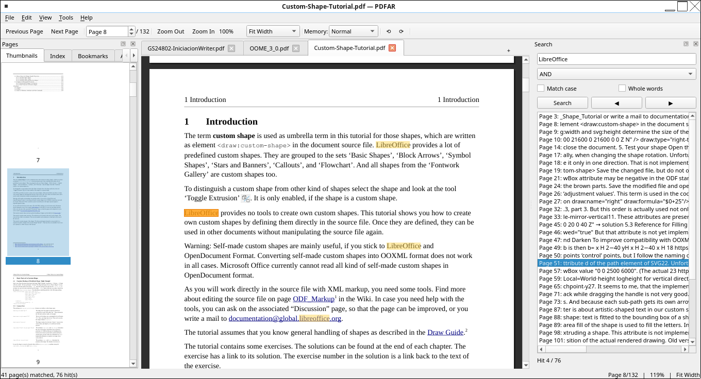

# PDFAR — Advanced PDF Reader for Linux

[](https://www.python.org/)
[](https://www.riverbankcomputing.com/software/pyqt/)
[](https://pymupdf.readthedocs.io/)
[](#-testing)
[](https://www.gnu.org/licenses/gpl-3.0.html)
[](https://www.linux.org/)

**PDFAR** is a fast, native-feeling PDF reader for Linux built with PyQt6 and PyMuPDF. Continuous scrolling, real text selection, instant search with highlighted hits, thumbnails, a document outline, fit modes, rotation and keyboard-first navigation.

---

## Why 1.x showed *no pages at all* (and how it is fixed)

The 1.x viewer handed render results back to the GUI like this:

```python
future = self.executor.submit(self._render_page_sync, page_index)
future.add_done_callback(
    lambda f: QTimer.singleShot(0, lambda: self._apply_render_done(f, page_index))
)
```

`add_done_callback` runs **inside the `ThreadPoolExecutor` worker thread**.  
`QTimer.singleShot(0, ...)` creates a timer bound to *the calling thread* — and a pool worker thread has **no Qt event loop**, so the timer never fires. `_apply_render_result()` therefore never ran, no pixmap was ever set, and the document area stayed empty forever. That is the "program does not show any PDF page" bug.

Fixes in 2.0 (there were ten other bugs behind it):

| # | 1.x bug | 2.0 fix |
|---|---------|---------|
| 1 | `QTimer.singleShot` from executor threads → results never delivered | `RenderPool` emits a Qt **signal** from the worker; Qt queues it to the GUI thread |
| 2 | Render results dropped when size rounded >2 px (`width_diff <= 2`) | Always accepted; drawing targets the page rectangle |
| 3 | `_get_visible_page_range()` stopped at the first page → range was 1 page | Real binary-search based range over page tops |
| 4 | `set_zoom()` never recomputed page tops/heights → stale geometry | `_relayout()` recomputes all geometry on every change |
| 5 | `PageCache` existed but was **never written** → every scroll re-rendered | Byte-budget LRU cache, keyed by (page, zoom, rotation) |
| 6 | `SearchWorker.run` never connected to `thread.started` → **search never ran** | Worker properly connected + its own document handle |
| 7 | `done` signal connected to a lambda → UI updated from the worker thread | Bound-method connections ⇒ queued to the GUI thread |
| 8 | One `fitz.Document` shared between threads (not thread-safe) | Every render thread opens its own handle |
| 9 | Highlights painted *into* the cached pixmap (they stacked up) | Overlays painted on top at paint time |
| 10 | `invalidate_zoom()` dropped the *new* zoom's cache instead of the old | Cache keyed per zoom, invalidated correctly |

---

---

## Features

- **Instant rendering** — priority render queue (visible pages first), worker threads with per-thread document handles, LRU bitmap cache (memory-budgeted).
- **Continuous scrolling** with smooth mouse-wheel / keyboard paging.
- **Real text selection** — drag to select across pages and columns, `Ctrl+C` to copy, `Ctrl+A` to select all (text comes from the PDF text layer, works with any rotation).
- **Search** — AND / OR / exact phrase, match-case, whole-words, per-page snippets, highlighted matches, `F3` / `Shift+F3` to jump between hits.
- **Sidebar** — page thumbnails (rendered in the background) and the document outline/table of contents with click-to-jump.
- **Zoom** — fit-page, fit-width, presets 50 %–400 %, `Ctrl` + mouse wheel zooms around the cursor.
- **Rotation** — 90° steps, with selection and highlights staying on the right words.
- **Encrypted PDFs** — password prompt, credentials are passed to the render workers only.
- **Comfort** — drag & drop to open, open from the command line, recent-file memory, remembered window layout, page spinner, status bar.

### Keyboard shortcuts

| Key | Action |
|-----|--------|
| `Ctrl+O` | Open PDF |
| `Ctrl+F` / `Ctrl+L` | Focus search |
| `F3` / `Shift+F3` | Next / previous search hit |
| `Ctrl++` / `Ctrl+-` | Zoom in / out |
| `Ctrl+0` / `Ctrl+1` / `Ctrl+2` | Fit page / 100 % / fit width |
| `Ctrl+Left` / `Ctrl+Right` | Rotate view |
| `Space` / `PgDown` / `PgUp` | Page down / up |
| `Home` / `End` | First / last page |
| `Ctrl+C` / `Ctrl+A` | Copy selection / select all |
| `Ctrl+wheel` | Zoom at cursor |

---

## Quick start

### Dependencies (Debian/Ubuntu)

```bash
sudo apt update
sudo apt install python3-pyqt6          # or: pip3 install --user PyQt6
pip3 install --user pymupdf             # PyMuPDF
```

### Run

```bash
python3 run.py                      # open the file dialog
```

And in the next screenshot, the program shows three PDFs open in three tabs; in one of them, the word "LibreOffice" is being searched for—a word that appears on many pages of that PDF.



or alternatively, for users who like using the terminal for many things:

```bash
python3 run.py /path/to/file.pdf    # open a document directly
```

### Install as a package (optional)

```bash
pip3 install --user .
pdfar /path/to/file.pdf
```

---

## ⚡ Large / Scanned PDF Performance Breakthrough

PDFAR underwent a dedicated **performance engineering milestone** targeting large and scanned PDFs. The rendering pipeline was redesigned around **demand-driven rendering**: render what the user currently needs first, avoid unnecessary work, cancel obsolete work, reuse rendered data, and keep memory usage bounded.

### Verified Benchmark Results

Testing with the 540-page LibreOffice Getting Started Guide (24 MB, heavy images):

| Metric | Before | After | Improvement |
|---|---:|---:|---:|
| open_document_time | 2.78 s | 1.96 s | **30% faster** |
| jobs_queued_during_open | 2,052 | 0 | **Eliminated** |
| time_to_first_page | 41.47 s | 0.66 s | **63x faster** |
| time_to_viewport_complete | 0.36 s | 0.0003 s | **1200x faster** |
| jump_to_distant_page | 0.96 s | 0.43 s | **2.2x faster** |
| zoom_sequence (100%→200%→300%) | 19.4 s | 1.81 s | **10.7x faster** |
| peak_rss_mb | 4,783 MB | 642 MB | **7.5x less memory** |

> **Note:** These results come from the project's performance benchmark (`tools/benchmark.py`) on a specific test PDF and hardware. They should not be presented as universal performance guarantees for every PDF or every machine.

### Major Technical Improvements

1. **Raw pixel buffer transport** — Replaced the PNG encode/decode round-trip with direct pixel buffer transfer. Worker threads now return raw `pix.samples` bytes + stride + format; the GUI thread constructs `QImage` directly. This removed ~180x PNG overhead.

2. **Lazy, viewport-aware thumbnail rendering** — Thumbnails are now only rendered for visible sidebar items. Opening a 540-page document queues ~5 thumbnails instead of all 540. Scroll/tab-change triggers lazy loading with a small margin; stale thumbnail jobs are cancelled when scrolling away.

3. **Correct memory-level default** — Fixed a bug where "greedy" memory level persisted from a previous session, causing full-document preloading on every open. Default is now "normal" (viewport + small prefetch).

4. **Faster page metadata access** — Changed `doc.load_page(i).rect` → `doc[i].rect` (~3x faster page size enumeration).

5. **Per-worker DisplayList caching** — Workers reuse `page.get_displaylist()` for repeated zooms/tiles (~2x speedup for zoom changes).

6. **Visible-content-first rendering architecture** — The first visible page receives absolute priority; background work is deprioritized and cancellable.

7. **Reduced unnecessary work during document opening** — Annotation scanning, thumbnail creation, and full-document layout are deferred or made lazy.

See `docs/en/developers/performance/large-pdf-performance.md` for the full technical deep-dive.

```
---

## Performance (measured)

On a 200-page A4 document (headless container, one page per page of text and charts): open ≈ 0.31 s, first page painted ≈ 0.22 s, jump to page 200 + render ≈ 0.13 s, zoom 100 %→300 % + render ≈ 0.5 s. The bitmap cache is bounded by memory (256 MB default) rather than by page count.

### Architecture notes

- **Rendering** happens off the GUI thread in `RenderPool` worker threads (priority queue → visible pages first). Results are PNG buffers, converted to `QImage` on the GUI thread — `QPixmap`/`QImage` must never be touched from worker threads.
- **Painting** is done directly in `PDFView.paintEvent`, so partial updates are cheap and overlays (highlights, selection) never corrupt the cached page.
- **Geometry** (`geometry.py`) is pure Python: all rotation/coordinate mapping is unit-tested so text selection and highlights cannot drift out of sync.

---

## Testing

The test suite runs fully headless (`QT_QPA_PLATFORM=offscreen`) and covers the regression that caused the blank-page bug:

```bash
python3 -m pytest tests/ -v
```

Highlights:

- `test_render.py::test_results_are_delivered_to_gui_thread` — render results really reach the GUI thread (the exact 1.x failure).
- `test_viewer.py::test_pages_actually_render_and_paint` — pixels of a known black square must be visible in the painted widget.
- `test_viewer.py::test_rotation_render_matches_geometry` — rendered bitmaps and the geometry helpers agree on rotation direction.
- `test_viewer.py::test_drag_selection_and_copy` — real mouse-drag selection.

---

## Debian packaging

See `DEBIAN.md`. A `debian/` directory with `changelog`/`copyright` is included as a starting point for building a `.deb`.

---

## Translations

`i18n.py` loads `translations/pdfar_<lang>.qm` (Qt Linguist) at startup when a file for the system locale exists. The UI strings are currently English; adding a language only requires producing a `.qm` file — no code changes.

---

## License

**GPL-3.0** — see [LICENSE](LICENSE) for details.

---

```
PDF-Advanced-Reader/
├── src/pdfar/          # Main application code
│   ├── __init__.py     # Package metadata
│   ├── main.py         # Main window and UI
│   ├── search.py       # Search logic
│   ├── viewer.py       # PDF rendering component
│   ├── cache.py        # Page caching
│   └── i18n.py         # Internationalization support
├── translations/       # Qt Linguist translation files
│   ├── pdfar_en.ts
│   └── pdfar_es.ts
├── debian/             # Debian packaging metadata (future)
├── run.py              # Entry point
├── compile_ts.py       # Translation compiler
└── README.md
```

---

## 🌍 Internationalization

PDFAR supports multiple languages through Qt Linguist:

| Language | Status |
|----------|--------|
| **English** | ✅ Primary |
| **Spanish** | ✅ Complete |
| **More** | 🔧 Extend via `.ts` files |

Add a new language:

1. Copy `pdfar_es.ts` → `pdfar_xx.ts`
2. Edit with Qt Linguist: `linguist pdfar_xx.ts`
3. Compile: `python3 compile_ts.py`

---

## 🛠️ Development

### Translate a New String

In Python code:

```python
# Use strings that are already in English
self.setWindowTitle("PDFAR - Advanced PDF Reader")
```

### Compile Translations

```bash
python3 compile_ts.py
```

---

## 🔧 Roadmap

- [ ] Thumbnail sidebar navigation
- [ ] Persistent annotations (saved highlights/notes)
- [ ] Export search results
- [ ] Dark mode support
- [ ] Full Debian package

---

## 🙏 Acknowledgements

This project owes a great debt to **Okular** (https://apps.kde.org/okular/), the
mature KDE document viewer (GPL-2.0+ / GPL-3.0+, by KDE and its contributors,
https://invent.kde.org/graphics/okular).

In particular, the tiled-rendering strategy that lets PDF-Advanced-Reader
display heavy, scanned PDFs smoothly at high zoom (render only the visible
tiles of a large page instead of one giant bitmap) was **directly inspired by
Okular's `TilesManager`** (see `core/document.cpp` in the Okular source). PDFAR
studied Okular's architecture and re-implemented the same *ideas* from scratch
in Python/PyQt6/PyMuPDF. Without Okular's proven approach, we would not have
solved this — thank you to the Okular developers.

---

## 📄 License

**GPL-3.0** — See [LICENSE](LICENSE) for details.

---

## 👤 Author

**Washington Indacochea Delgado**  
Email: linuxfrontier@proton.me

---

## 🤝 Contributing

Contributions are welcome! Please follow these steps:

1. Fork the repository
2. Create a feature branch
3. Submit a pull request
