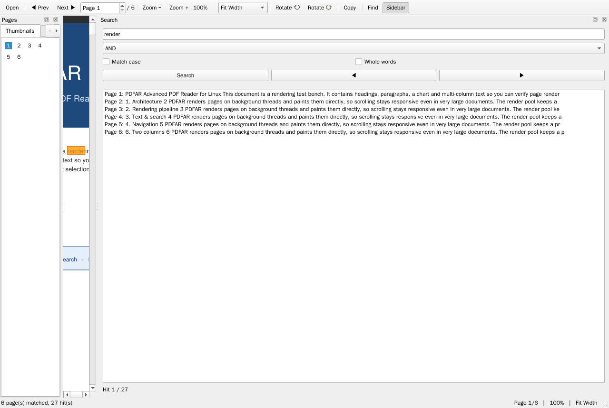

# PDFAR — Advanced PDF Reader for Linux

[](https://www.python.org/)
[](https://www.riverbankcomputing.com/software/pyqt/)
[](https://pymupdf.readthedocs.io/)
[](#-testing)

**PDFAR** is a fast, native-feeling PDF reader for Linux built with PyQt6 and PyMuPDF.
Continuous scrolling, real text selection, instant search with highlighted hits,
thumbnails, a document outline, fit modes, rotation and keyboard-first navigation.

---

## Why 1.x showed *no pages at all* (and how it is fixed)

The 1.x viewer handed render results back to the GUI like this:

```python
future = self.executor.submit(self._render_page_sync, page_index)
future.add_done_callback(
    lambda f: QTimer.singleShot(0, lambda: self._apply_render_done(f, page_index))
)
```

`add_done_callback` runs **inside the `ThreadPoolExecutor` worker thread**.
`QTimer.singleShot(0, ...)` creates a timer bound to *the calling thread* — and a
pool worker thread has **no Qt event loop**, so the timer never fires.
`_apply_render_result()` therefore never ran, no pixmap was ever set, and the
document area stayed empty forever. That is the "program does not show any PDF
page" bug.

Fixes in 2.0 (there were ten other bugs behind it):

| # | 1.x bug | 2.0 fix |
|---|---------|---------|
| 1 | `QTimer.singleShot` from executor threads → results never delivered | `RenderPool` emits a Qt **signal** from the worker; Qt queues it to the GUI thread |
| 2 | Render results dropped when size rounded >2 px (`width_diff <= 2`) | Always accepted; drawing targets the page rectangle |
| 3 | `_get_visible_page_range()` stopped at the first page → range was 1 page | Real binary-search based range over page tops |
| 4 | `set_zoom()` never recomputed page tops/heights → stale geometry | `_relayout()` recomputes all geometry on every change |
| 5 | `PageCache` existed but was **never written** → every scroll re-rendered | Byte-budget LRU cache, keyed by (page, zoom, rotation) |
| 6 | `SearchWorker.run` never connected to `thread.started` → **search never ran** | Worker properly connected + its own document handle |
| 7 | `done` signal connected to a lambda → UI updated from the worker thread | Bound-method connections ⇒ queued to the GUI thread |
| 8 | One `fitz.Document` shared between threads (not thread-safe) | Every render thread opens its own handle |
| 9 | Highlights painted *into* the cached pixmap (they stacked up) | Overlays painted on top at paint time |
| 10 | `invalidate_zoom()` dropped the *new* zoom's cache instead of the old | Cache keyed per zoom, invalidated correctly |

---

## Features

- **Instant rendering** — priority render queue (visible pages first), worker
  threads with per-thread document handles, LRU bitmap cache (memory-budgeted).
- **Continuous scrolling** with smooth mouse-wheel / keyboard paging.
- **Real text selection** — drag to select across pages and columns, `Ctrl+C` to
  copy, `Ctrl+A` to select all (text comes from the PDF text layer, works with
  any rotation).
- **Search** — AND / OR / exact phrase, match-case, whole-words, per-page
  snippets, highlighted matches, `F3` / `Shift+F3` to jump between hits.
- **Sidebar** — page thumbnails (rendered in the background) and the document
  outline/table of contents with click-to-jump.
- **Zoom** — fit-page, fit-width, presets 50 %–400 %, `Ctrl` + mouse wheel zooms
  around the cursor.
- **Rotation** — 90° steps, with selection and highlights staying on the right
  words.
- **Encrypted PDFs** — password prompt, credentials are passed to the render
  workers only.
- **Comfort** — drag & drop to open, open from the command line, recent-file
  memory, remembered window layout, page spinner, status bar.

### Keyboard shortcuts

| Key | Action |
|-----|--------|
| `Ctrl+O` | Open PDF |
| `Ctrl+F` / `Ctrl+L` | Focus search |
| `F3` / `Shift+F3` | Next / previous search hit |
| `Ctrl++` / `Ctrl+-` | Zoom in / out |
| `Ctrl+0` / `Ctrl+1` / `Ctrl+2` | Fit page / 100 % / fit width |
| `Ctrl+Left` / `Ctrl+Right` | Rotate view |
| `Space` / `PgDown` / `PgUp` | Page down / up |
| `Home` / `End` | First / last page |
| `Ctrl+C` / `Ctrl+A` | Copy selection / select all |
| `Ctrl+wheel` | Zoom at cursor |



---

## Quick start

### Dependencies (Debian/Ubuntu)

```bash
sudo apt update
sudo apt install python3-pyqt6          # or: pip3 install --user PyQt6
pip3 install --user pymupdf             # PyMuPDF
```

### Run

```bash
python3 run.py                      # open the file dialog
python3 run.py /path/to/file.pdf    # open a document directly
```

### Install as a package (optional)

```bash
pip3 install --user .
pdfar /path/to/file.pdf
```

---

## Project structure

```
PDF-Advanced-Reader/
├── run.py                  # entry point (adds src/ to sys.path)
├── demo.pdf                # generated sample document (tools/make_demo_pdf.py)
├── src/pdfar/
│   ├── main.py             # main window, toolbar, search dock, shortcuts
│   ├── viewer.py           # the PDF view: painting, zoom, selection, search
│   ├── render.py           # thread-safe priority render pool
│   ├── cache.py            # LRU cache of rendered pages (byte budget)
│   ├── geometry.py         # rotation & coordinate mapping (pure, tested)
│   ├── search.py           # search parameters + background search worker
│   ├── sidebar.py          # thumbnails + document outline
│   └── i18n.py             # Qt Linguist based translations
├── tests/                  # pytest suite (runs headless)
├── tools/                  # screenshot.py, make_demo_pdf.py
└── translations/           # .ts sources for the UI strings
```

### Performance (measured)

On a 200-page A4 document (headless container, one page per page of text and
charts): open ≈ 0.31 s, first page painted ≈ 0.22 s, jump to page 200 + render
≈ 0.13 s, zoom 100 %→300 % + render ≈ 0.5 s.  The bitmap cache is bounded by
memory (256 MB default) rather than by page count.

### Architecture notes

- **Rendering** happens off the GUI thread in `RenderPool` worker threads
  (priority queue → visible pages first). Results are PNG buffers, converted to
  `QImage` on the GUI thread — `QPixmap`/`QImage` must never be touched from
  worker threads.
- **Painting** is done directly in `PDFView.paintEvent`, so partial updates are
  cheap and overlays (highlights, selection) never corrupt the cached page.
- **Geometry** (`geometry.py`) is pure Python: all rotation/coordinate mapping
  is unit-tested so text selection and highlights cannot drift out of sync.

---

## Testing

The test suite runs fully headless (`QT_QPA_PLATFORM=offscreen`) and covers the
regression that caused the blank-page bug:

```bash
python3 -m pytest tests/ -v
```

Highlights:

- `test_render.py::test_results_are_delivered_to_gui_thread` — render results
  really reach the GUI thread (the exact 1.x failure).
- `test_viewer.py::test_pages_actually_render_and_paint` — pixels of a known
  black square must be visible in the painted widget.
- `test_viewer.py::test_rotation_render_matches_geometry` — rendered bitmaps and
  the geometry helpers agree on rotation direction.
- `test_viewer.py::test_drag_selection_and_copy` — real mouse-drag selection.

---

## Debian packaging

See `DEBIAN.md`. A `debian/` directory with `changelog`/`copyright` is included
as a starting point for building a `.deb`.

## Translations

`i18n.py` loads `translations/pdfar_<lang>.qm` (Qt Linguist) at startup when a
file for the system locale exists. The UI strings are currently English; adding
a language only requires producing a `.qm` file — no code changes.

## License

GPL-3.0 — see `debian/copyright`.
